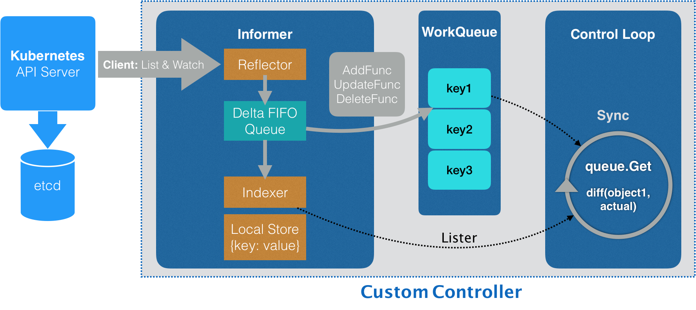

# k8s如何开发一个crontoller笔记整理

前面学习go并简单的写了一个小项目，5月开始看k8s相关的知识。花了一些时间搞懂controller的原理，也参考了一些blog。但是网上的那些blog真的是恶心，只讲操作至于原理基本不讲的，很反感这样。感觉他们自己都没搞清楚，然后就直接写起来了。

学起来很费劲，果然最好的方法还是去看官方的文档和代码！

花了很多时间，终于跑通了整个流程，快没激情了。

简单的整理记录一下，先翻篇。


## 控制器原理



CRD控制器的工作流，可分为`监听`、`同步`、`触发`三个步骤：

1. `监听`  Controller 首先会通过 Informer机制（实际上是Reflector组件） （所谓的 Informer，是一种自带缓存和索引的机制），从K8s的API Server中获取它所关心的资源对象，如果发生相应的变更事件时（add/update/delete）就会将资源对象放到DeltaFIFO中。

   ```
   举个例子，也就是本例子的 Controller 获取的是 AppService 资源对象。值得注意的是 Informer 在构建之前，会使用生成的代码 client, 再通过 Reflector 的 ListAndWatch 机制跟 APIServer 建立连接，不断地监听 AppService 资源对象的变化。在 ListAndWatch 机制下，一旦 APIServer 端有新的 AppService 实例被创建、删除或者更新，Reflector 都会收到事件通知。该事件及它对应的 API 对象会被放进 Delta FIFO Queue中。
   ```

   

2. `同步` Local Store 此时完成同步缓存操作 。

   ```
   Reflector从DeltaFIFO将消费出来的资源对象存储到Indexer中。
   ```

   

3. `触发` Informer 根据这些事件的类型，触发对应事件的回调方法将资源对象推送到workerqueue中，controller再从workerqueue和indexer中读取信息进行对比，完成对应的业务逻辑操作。


## 自定义控制器开发流程

1. copy官方的代码框架，删除自动生成的代码。

2. 定义CRD资源

3. 更新文件doc.go register.go type.go 等文件

4. 执行脚本生成，自动生成代码。

5. 更新controller.go 文件

6. 编译生成二进制文件，部署到集群。

   

PS: 也可以使用框架生成所有的代码，然后我们只要 改改改 就行了！


## 流程介绍和代码

[app-controller-demo 仓库地址]( https://github.com/feiwang137/app-controller-demo)


#### 更新文件

types.go

定义AppService有哪些类型

```
package v1alpha1

import (
	metav1 "k8s.io/apimachinery/pkg/apis/meta/v1"
)

// +genclient
// +genclient:noStatus
// +k8s:deepcopy-gen:interfaces=k8s.io/apimachinery/pkg/runtime.Object

// AppService describes a AppService resource
type AppService struct {
	metav1.TypeMeta `json:",inline"`
	metav1.ObjectMeta `json:"metadata,omitempty"`
	Spec AppServiceSpec `json:"spec"`
	Status AppServiceStatus `json:"status"`
}

type AppServiceSpec struct {
	DeploymentName string `json:"deploymentName"`
	Replicas       *int32 `json:"replicas"`
}

type AppServiceStatus struct {
	AvailableReplicas int32 `json:"availableReplicas"`
}

// +k8s:deepcopy-gen:interfaces=k8s.io/apimachinery/pkg/runtime.Object
type AppServiceList struct {
	metav1.TypeMeta `json:",inline"`
	metav1.ListMeta `json:"metadata"`

	Items []AppService `json:"items"`
}

```

register.go

将AppService类型注册到ApiServer

```
package v1alpha1

import (
	"github.com/feiwang137/app-controller-demo/pkg/apis/appcontroller"
	metav1 "k8s.io/apimachinery/pkg/apis/meta/v1"
	"k8s.io/apimachinery/pkg/runtime"
	"k8s.io/apimachinery/pkg/runtime/schema"
)

var SchemeGroupVersion = schema.GroupVersion{
	Group:   appcontroller.GroupName,
	Version: appcontroller.Version,
}

var (
	SchemeBuilder = runtime.NewSchemeBuilder(addKnownTypes)
	AddToScheme   = SchemeBuilder.AddToScheme
)

func Resource(resource string) schema.GroupResource {
	return SchemeGroupVersion.WithResource(resource).GroupResource()
}

func Kind(kind string) schema.GroupKind {
	return SchemeGroupVersion.WithKind(kind).GroupKind()
}


// 这里会用到后面自动生成的代码
func addKnownTypes(scheme *runtime.Scheme) error {
	scheme.AddKnownTypes(
		SchemeGroupVersion,
		&AppService{},
		&AppServiceList{},
	)

	metav1.AddToGroupVersion(scheme, SchemeGroupVersion)
	return nil
}
```

doc.go

doc.go 文件的注释，起到的是全局的代码生成控制的作用，所以也被称为 Global Tags。

```
// +k8s:deepcopy-gen=package

// +groupName=appcontroller.k8s.io
package v1alpha1
```

controller.go 

syncHandler 按照实际的业务需求进行修改。

#### 生成代码

```
./hack/update-codegen.sh 
```

执行后将自动生成 zz_generated.deepcopy.go / clientset   /    informers    /   listers ; 等文件


#### 编译-部署

参考官方文档.. 略...


### 参考链接

client-go相关模块：https://github.com/kubernetes/sample-controller/blob/master/docs/controller-client-go.md

官方的例子：https://github.com/kubernetes/sample-controller

CRD开发实践`好多错字 看着好难受`：https://lihaoquan.me/posts/k8s-crd-develop/

