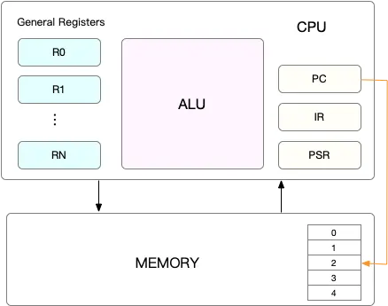
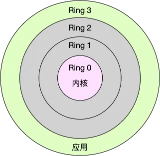

# CPU上下文切换

## 原理解释

抛出问题： 进程在竞争 CPU 的时候并没有真正运行，为什么还会导致系统的负载升高呢？

Linux 是一个多任务操作系统，它支持远大于 CPU 数量的任务同时运行。
当然，这些任务实际上并不是真的在同时运行，而是因为系统在很短的时间内，将 CPU 轮流分配给它们，造成多任务同时运行的错觉。

### 什么是寄存器和计数器？

CPU 在每个任务运行前，CPU 都需要知道任务从哪里加载、又从哪里开始运行，也就是说，需要系统事先帮它设置好 CPU 寄存器和程序计数器（Program Counter，PC）。

CPU 寄存器： 是 CPU 内置的容量小、但速度极快的内存。
而程序计数器： 则是用来存储 CPU 正在执行的指令位置、或者即将执行的下一条指令位置。

它们都是 CPU 在运行任何任务前，必须的依赖环境，因此也被叫做 CPU 上下文。

> 什么是上下文切换？

CPU 上下文切换，就是先把前一个任务的 CPU 上下文（也就是 CPU 寄存器和程序计数器）保存起来，然后加载新任务的上下文到这些寄存器和程序计数器，最后再跳转到程序计数器所指的新位置，运行新任务。
而这些保存下来的上下文，会`存储在系统内核中`，并在任务重新调度执行时再次加载进来。这样就能保证任务原来的状态不受影响，让任务看起来还是连续运行。

### 上下文切换的类型

#### 进程上下文切换

Linux 按照特权等级，把进程的运行空间分为内核空间和用户空间，分别对应着下图中， CPU 特权等级的 Ring 0 和 Ring 3。

内核空间（Ring 0）：具有最高权限，可以直接访问所有资源；

用户空间（Ring 3）：只能访问受限资源，不能直接访问内存等硬件设备，必须通过系统调用陷入到内核中，才能访问这些特权资源。

进程在用户空间运行时，被称为进程的**用户态**，而陷入内核空间的时候，被称为进程的**内核态**。

从用户态到内核态的转变，需要通过系统调用来完成。

**例子**：当我们查看文件内容时，就需要多次系统调用来完成：首先调用 open() 打开文件，然后调用 read() 读取文件内容，并调用 write() 将内容写到标准输出，最后再调用 close() 关闭文件。

系统调用时，将发生2次cpu的上下文切换。（用户态切换到内核态，内核态再切换到用户态。）系统调用不涉及进程用户态的资源变动。

> 进程上下文切换和系统调用的区别

进程的上下文切换就比系统调用时多了一步：在保存当前进程的内核状态和 CPU 寄存器之前，需要先把该进程的**虚拟内存、内核栈**等保存下来；而加载了下一进程的内核态后，还需要刷新进程的虚拟内存和用户栈。

特别注意的是进程的上下文切换时需要耗费cpu时间来更新**cpu寄存器、虚拟内存、内核栈**等资源的保存恢复上，因此也会导致系统平均负载的上升。

另外虚拟内存的更新，也还导致TLB需要更新，导致数据访问变慢。

> 什么情况下会发生进程上下文切换的情况？

进程切换时才需要切换上下文，换句话说，`只有在进程调度`的时候，才需要切换上下文。
Linux 为每个 CPU 都维护了一个就绪队列，将活跃进程（即正在运行和正在等待 CPU 的进程）按照优先级和等待 CPU 的时间排序，然后选择最需要 CPU 的进程，也就是优先级最高和等待 CPU 时间最长的进程来运行。

**场景**

1. 进程执行完了，可以执行下一个进程了。从就绪队列里面获取新的进程运行。
2. CPU的时间片耗尽，系统自动挂起切换其他进程。
3. 系统资源不足，导致的挂起。
4. sleep类型的函数，主动挂起。
5. 有更高的优先级别的进程运行。
6. 发生硬件中断时。

#### 线程上下文切换

线程和进程的区别：线程是调度的基本单位，进程则是资源拥有的基本单位。

说人话，所谓内核中的任务调度，实际上的调度对象是线程；而进程只是给线程提供了虚拟内存、全局变量等资源。所以，对于线程和进程，我们可以这么理解：

- 当进程只有一个线程时，可以认为进程就等于线程。
- 当进程拥有多个线程时，这些线程会共享相同的虚拟内存和全局变量等资源。这些资源在上下文切换是不需要修改的。
- 另外，线程也有自己的私有数据，比如栈和寄存器等，这些在上下文切换时也是需要保存的。同进程的上下文切换是一样的。

因此线程比进程上下文切换带来的优势是，当同一个进程里面的线程需要进行上下文切换时是比多进程进行上下文切换少了一个步骤，少消耗资源，有性能上的优势。

#### 中断上下文切换

为了快速响应硬件的事件，中断处理会打断进程的正常调度和执行，转而调用中断处理程序，响应设备事件。

中断上下文切换`并不涉及到进程的用户态`，只包括内核态中断服务程序执行所必需的状态，包括 CPU 寄存器、内核堆栈、硬件中断参数等。

中断处理比进程拥有更高的优先级，所以中断上下文切换并不会与进程上下文切换同时发生。`由于中断会打断正常进程的调度和执行，所以大部分中断处理程序都短小精悍，以便尽可能快的执行结束。`

跟进程上下文切换一样，中断上下文切换也需要消耗 CPU，切换次数过多也会耗费大量的 CPU，甚至严重降低系统的整体性能。

## 案例，如何分析上下文切换