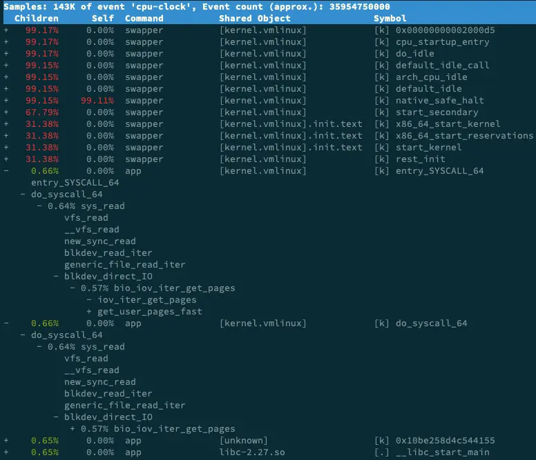

# 僵尸进程和不可中断进程
-----

进程的几种状态
     28. S  --  Process Status
           The status of the task which can be one of:
               D = uninterruptible sleep
               R = running
               S = sleeping
               T = stopped by job control signal
               t = stopped by debugger during trace
               Z = zombie

正常情况下，父进程如何会后紫禁城的资源 
僵尸进程产生的原因


案例
  进程组和会话的概念

------


## 进程状态

使用top输出的进程状态(可以在man top里面查看得到，里面也有解释的): 

- R 是 Running 或 Runnable 的缩写，表示进程在 CPU 的就绪队列中，正在运行或者正在等待运行。
- D 是 Disk Sleep 的缩写，也就是不可中断状态睡眠（Uninterruptible Sleep），一般表示进程正在跟硬件交互，并且交互过程不允许被其他进程或中断打断。
- Z 是 Zombie 的缩写，如果你玩过“植物大战僵尸”这款游戏，应该知道它的意思。它表示僵尸进程，也就是进程实际上已经结束了，但是父进程还没有回收它的资源（比如进程的描述符、PID 等）。
- S 是 Interruptible Sleep 的缩写，也就是可中断状态睡眠，表示进程因为等待某个事件而被系统挂起。当进程等待的事件发生时，它会被唤醒并进入 R 状态。
- I 是 Idle的缩写，也就是空闲状态，用在不可中断睡眠的内核线程上。前面说了，硬件交互导致的不可中断进程用 D 表示，但对某些内核线程来说，它们有可能实际上并没有任何负载，用 Idle 正是为了区分这种情况。要注意，D 状态的进程会导致平均负载升高， I 状态的进程却不会。
- X 是 Dead 的缩写，表示进程已经消亡，所以你不会在 top 或者 ps 命令中看到它。
- T 或者 t，也就是 Stopped 或 Traced 的缩写，表示进程处于暂停或者跟踪状态。

> 僵尸进程

僵尸进程表示进程已经退出，但它的父进程还没有回收子进程占用的资源。

正常处理的流程： 正常情况下，当一个进程创建了子进程后，它应该通过系统调用 wait() 或者 waitpid() 等待子进程结束，回收子进程的资源；而子进程在结束时，会向它的父进程发送 SIGCHLD 信号，所以，父进程还可以注册 SIGCHLD 信号的处理函数，异步回收资源。

僵尸进程产生的原因：如果父进程没这么做，或是子进程执行太快，父进程还没来得及处理子进程状态，子进程就已经提前退出，那这时的子进程就会变成僵尸进程。

一旦父进程没有处理子进程的终止，还一直保持运行状态，那么子进程就会一直处于僵尸状态。大量的僵尸进程会用尽 PID 进程号，导致新进程不能创建，所以这种情况一定要避免。


## 案例

启动测试应用

```
# docker run --privileged --name=app -itd feisky/app:iowait /app -d /dev/vda
```

top 查看资源

```
# 按下数字 1 切换到所有 CPU 的使用情况，观察一会儿按 Ctrl+C 结束
$ top
top - 05:56:23 up 17 days, 16:45,  2 users,  load average: 2.00, 1.68, 1.39
Tasks: 247 total,   1 running,  79 sleeping,   0 stopped, 115 zombie <--------
%Cpu0  :  0.0 us,  0.7 sy,  0.0 ni, 38.9 id, 60.5 wa,  0.0 hi,  0.0 si,  0.0 st <--------
%Cpu1  :  0.0 us,  0.7 sy,  0.0 ni,  4.7 id, 94.6 wa,  0.0 hi,  0.0 si,  0.0 st <--------
...

  PID USER      PR  NI    VIRT    RES    SHR S  %CPU %MEM     TIME+ COMMAND
 4340 root      20   0   44676   4048   3432 R   0.3  0.0   0:00.05 top
 4345 root      20   0   37280  33624    860 D   0.3  0.0   0:00.01 app <--------
 4344 root      20   0   37280  33624    860 D   0.3  0.4   0:00.01 app <--------
    1 root      20   0  160072   9416   6752 S   0.0  0.1   0:38.59 systemd
...

```

异常现象：
1. 有大量的zombie
2. iowait很高
3. 有D状态的进程

#### iowait高分析

排查思路：
1. iowait升高，通过查看和系统相关的信息来排查。dstat
2. 找到导致iowait升高的那个应用。pidstat
3. 分析这个进程是干了什么事情，导致的iowait升高。perf

使用到的工具：
- dstat 查看cpu和IO的资源使用信息
- pidstat -d 查看进程磁盘相关的信息
- perf record -g 确认是app导致的iowait升高

使用dstat查看cpu和io的信息

```

# 间隔1秒输出10组数据
$ dstat 1 10
You did not select any stats, using -cdngy by default.
--total-cpu-usage-- -dsk/total- -net/total- ---paging-- ---system--
usr sys idl wai stl| read  writ| recv  send|  in   out | int   csw
  0   0  96   4   0|1219k  408k|   0     0 |   0     0 |  42   885
  0   0   2  98   0|  34M    0 | 198B  790B|   0     0 |  42   138  <--------
  0   0   0 100   0|  34M    0 |  66B  342B|   0     0 |  42   135  <--------
  0   0  84  16   0|5633k    0 |  66B  342B|   0     0 |  52   177
  0   3  39  58   0|  22M    0 |  66B  342B|   0     0 |  43   144
  0   0   0 100   0|  34M    0 | 200B  450B|   0     0 |  46   147  <--------
  0   0   2  98   0|  34M    0 |  66B  342B|   0     0 |  45   134  <--------
  0   0   0 100   0|  34M    0 |  66B  342B|   0     0 |  39   131  <--------
  0   0  83  17   0|5633k    0 |  66B  342B|   0     0 |  46   168
  0   3  39  59   0|  22M    0 |  66B  342B|   0     0 |  37   134  <--------

```
说明 iowait 的升高跟磁盘的读请求有关，很可能就是磁盘读导致的。


使用pidstat查看所有进程的磁盘使用信息

```
# 间隔 1 秒输出多组数据 (这里是 20 组)
$ pidstat -d 1 20
...
06:48:46      UID       PID   kB_rd/s   kB_wr/s kB_ccwr/s iodelay  Command
06:48:47        0      4615      0.00      0.00      0.00       1  kworker/u4:1
06:48:47        0      6080  32768.00      0.00      0.00     170  app
06:48:47        0      6081  32768.00      0.00      0.00     184  app

06:48:47      UID       PID   kB_rd/s   kB_wr/s kB_ccwr/s iodelay  Command
06:48:48        0      6080      0.00      0.00      0.00     110  app

06:48:48      UID       PID   kB_rd/s   kB_wr/s kB_ccwr/s iodelay  Command
06:48:49        0      6081      0.00      0.00      0.00     191  app

06:48:49      UID       PID   kB_rd/s   kB_wr/s kB_ccwr/s iodelay  Command

06:48:50      UID       PID   kB_rd/s   kB_wr/s kB_ccwr/s iodelay  Command
06:48:51        0      6082  32768.00      0.00      0.00       0  app
06:48:51        0      6083  32768.00      0.00      0.00       0  app

06:48:51      UID       PID   kB_rd/s   kB_wr/s kB_ccwr/s iodelay  Command
06:48:52        0      6082  32768.00      0.00      0.00     184  app
06:48:52        0      6083  32768.00      0.00      0.00     175  app

06:48:52      UID       PID   kB_rd/s   kB_wr/s kB_ccwr/s iodelay  Command
06:48:53        0      6083      0.00      0.00      0.00     105  app
...


PS: 发现app进程有大量的读操作。

```

通过perf分析app进程在做什么

ps: 这里也可以使用strace（系统调用分析工具）进行分析，但如果是僵尸进程的话，就没有办法搞了！所以这里得用perf查看进程的调用信息。

```
$ perf record -g
$ perf report

```



app 的确在通过系统调用 sys_read() 读取数据。并且从 new_sync_read 和 blkdev_direct_IO 能看出，进程正在对磁盘进行直接读，也就是绕过了系统缓存，每个读请求都会从磁盘直接读，这就可以解释我们观察到的 iowait 升高了。


> 僵尸进程处理

通过stree找出产生僵尸进程的父进程，调查谁是父进程。然后再去检查父进程所在的应用代码。这里只找出父进程即可。


```
1. 通过top（Z状态的）或者是ps（defunct）获取僵尸进程的进程pid 。
2. 通过pstree找到僵尸进程的父进程。pstree -aps "僵尸进程的pid"
3. check应用的代码吗，进行优化。
```


